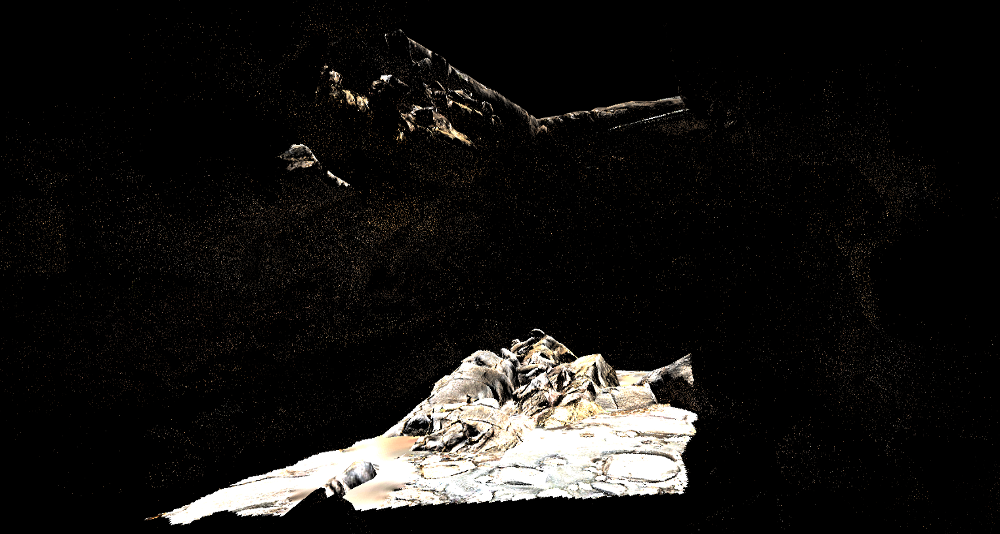

# games202_homework
闫老师games202作业

| 截图 | 截图 | 截图 | 
| --- | - | --- | 
| 1.实时阴影 | 硬阴影，Two Pass Shadow Map方案 |  | 
|  | 软阴影，PCF方案、阴影在边缘处模糊 |  | 
|  | 软阴影，PCSS方案、阴影在遮挡物和阴影之间 距离近的地方阴影偏硬，在距离远的地方则为软阴影 |  | 
| 2.全局光照 | 无自阴影漫反射 |  | 
|  | 自阴影漫反射 |  | 
|  | 多次弹射漫反射 |  | 
|  | 环境光球偕旋转，低阶SH快速旋转方法 |  | 
| 3.屏幕空间下的全局光照效果 | SSRT(屏幕空间光线追踪)，直接光照1 |  | 
|  | SSRT(屏幕空间光线追踪)，间接光照SPP1 |  | 
| 4.BRDF光照预计算补偿 | 下面BRDF，上面Kulla-Conty BRDF |  | 
| 5.实时光线追踪降噪 | 单帧图像的降噪，联合双边滤波 |  | 
|  | 上一帧投影到当前帧计算 motion vector |  | 
|  | 累计多帧进行混合降噪 |  | 
